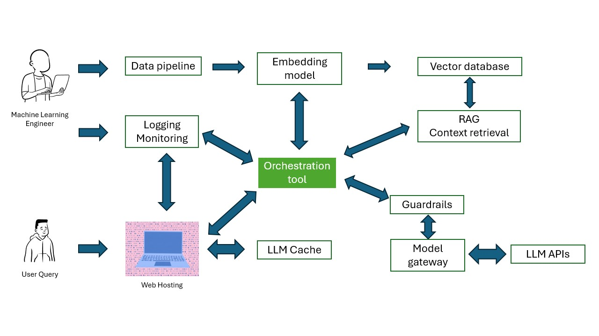

LLM &amp; LLMOps

# Chatbot LLMOps with RAG


A production-ready chatbot system implementing Retrieval-Augmented Generation (RAG) with Django, Celery, and OpenAI. The system uses Qdrant for vector storage and MariaDB for conversation management.

## Architecture

- **Backend**: Django + Django REST Framework
- **Vector Store**: Qdrant
- **Database**: MariaDB
- **Message Queue**: Redis + Celery
- **LLM Integration**: OpenAI API
- **Frontend**: Streamlit UI

## Features

- Conversational memory with persistent storage
- Asynchronous message processing using Celery
- Vector similarity search for relevant context retrieval
- Document management system
- Real-time chat interface
- Admin dashboard for system management

## Prerequisites

- Python 3.10+
- Docker and Docker Compose
- OpenAI API key
- MariaDB
- Redis

## Installation

1. Clone the repository

2. Set up environment variables:
```bash
env
MYSQL_ROOT_PASSWORD='root_password'
MYSQL_HOST='mariadb-tiny'
MYSQL_PORT=3306
OPENAI_API_KEY='your-openai-api-key'
```
3. Create network:
```bash
docker network create internal-network
```

4. Install dependencies:

For Mac:
```bash
bash
brew install mysql-client pkg-config
export PKG_CONFIG_PATH="$(brew --prefix)/opt/mysql-client/lib/pkgconfig"
```

